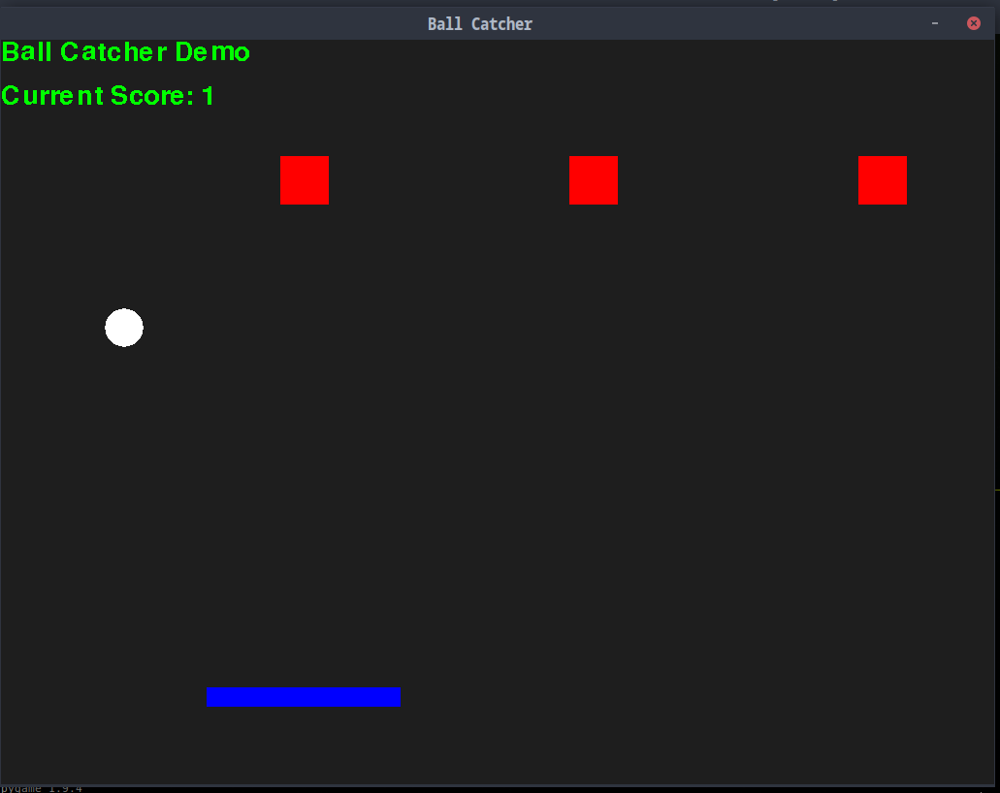
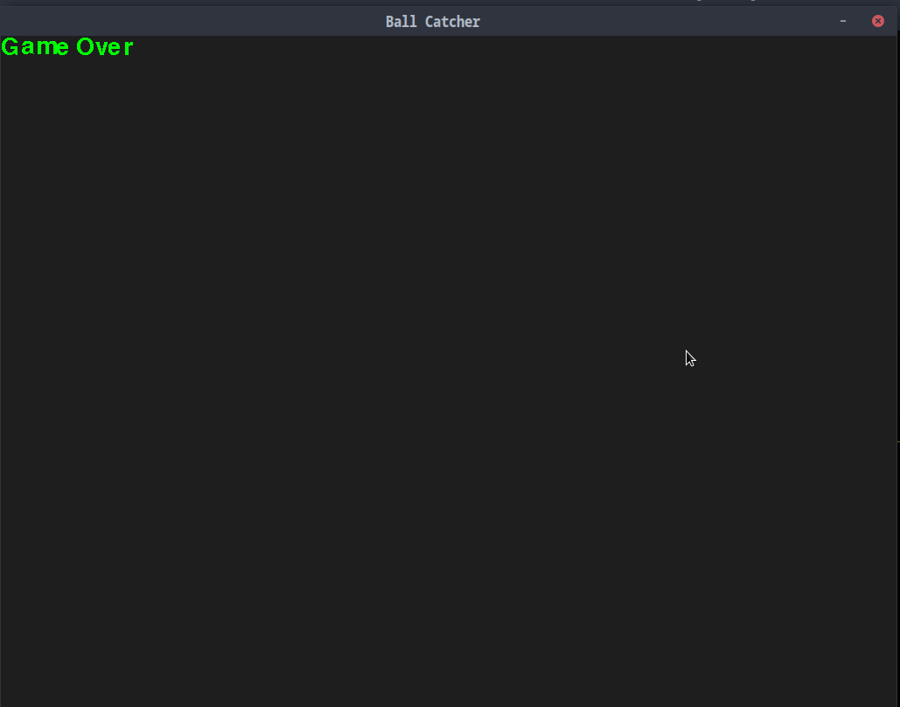

# pygame-thing
For some reason I always make conglomerate one file monoliths for stuff when they are not projects.



Studying from this is probably not a good idea.
It works though. Requires pygame which you can install with
PIP if you have it with

```
  pip install pygame
```
